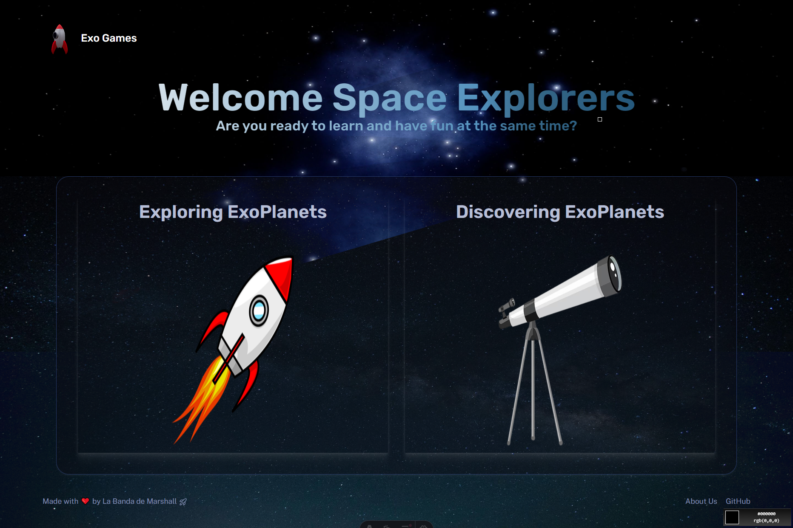

# NasaSpaceApp ExoGames - La Banda de Marshall 🎨🚀




NasaSpaceApp ExoGames is more than just a project; it aims to teach children about exoplanets in an easy, engaging, and innovative way. 
It allows children to learn about exoplanets in a unique and captivating manner, different from traditional methods, ensuring they stay engaged and excited.
By utilizing Astro for building ultra-fast and modern websites, along with React and Three.js for creating interactive 3D experiences, this project offers a perfect combination of performance and aesthetics. 

## Features ✨

- **Astro** for building ultra-fast, modern websites.
- **React** and **Three.js** for creating interactive 3D experiences.
- Responsive design optimized for all devices.
- Fast loading with optimized assets for 3D models and animations.

## Demo 🔍

Check out the live demo here: exogames.vercel.app (#)

## Installation 🛠️

Follow these steps to install the project

1. **Clone the repository:**

   ```bash
   git clone https://github.com/FranprzDev/NSApp-Marshall-Arg

Navigate to the project folder:

bash
Copy code
cd NSApp-Marshall-Arg
Install dependencies:

bash
Copy code
npm install
Run the development server:

bash
Copy code
npm run dev
Your site will be live at http://localhost:3000/.

## 🧞 Commands

All commands are run from the root of the project, from a terminal:

| Command                   | Action                                           |
| :------------------------ | :----------------------------------------------- |
| `npm install`             | Installs dependencies                            |
| `npm run dev`             | Starts local dev server at `localhost:4321`      |